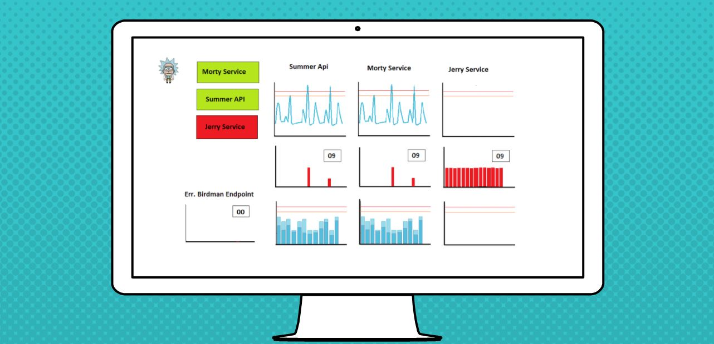

> An overview on the different forms of dashboards, what they are useful for and for whom.

Monitoring is an expansive topic from instrumentation to logging in all it's forms. One part of instrumentation is dashboards - the visualisation of your metrics and measurements. Dashboards can have numerous purposes from enabling a clear view of the important parts of a software system, to measuring the overall health of a business.

It's no secret that I am fascinated by the topic of monitoring. I want to find out what people do in their companies, pain points, how to do it well and the awesome things that can come from having a well monitored system. As part of my work in this area previously I tried something to get more departments in the company I worked for invested and bought into what was begin instrumented in our system. You can read the blog covering that experiment [here](https://jesswhite.co.uk/instrumentationforbusiness-post/). I think dashboards are powerful, often underutilised and that there isn't enough resource talking about them out there. 

There are a lot of common questions around dashboards including how long they should live and what should be on them. These questions aren't going to be addressed in this post. Instead, we are taking a step back to examine what types of dashboards there are, what they are for, and who needs them. Hopefully, by the end of this, you'll want to learn more about how dashboards can be used in your company, but also how to do them well. Dashboards are beautiful and powerful tools. They come in many forms, each with their own strengths, purpose and evolution. There is a bit of overlap on these categories and how they are used, which will be covered.

The information in this post uses a cumulation of my own experience (I have been involved in the development of developer, MI and BI dashboards), talking to those with more experience than myself and extensive reading. Any resources I used and people who kindly gave me their time to discuss dashboards with are listed at the end.

## MI and BI Dashboards

These dashboards are primarily for business use. The data on them are relatively high level. They are used for measuring the health of a business and for planning the future direction of the company. 

First of all, let's explore BI (aka Business Intelligence) dashboards. These show data that can be used to inform business strategy. These may include any major events that have had an effect on the business to help structure future plans. Is the business meeting their Key Performance Indicators (KPI's)? Are these begin met on schedule? If not, is there any clear reason why they may have not been met? Can the measurements we have be extrapolated to estimate when we are going to meet overarching goals? Using BI dashboards, you can see the effectiveness of past efforts to help guide future ones, as well as judging if the business is healthy overall. Metrics on these dashboards may include:

* Real time achievement vs business / board goals.
* A unit important to the business across time. I.e. customer numbers over the last year. This can be used to judge if the customer base is on the rise, if there are times of year which effect the performance of the business and therefore any planned initiatives.

These types of boards are principally aimed to assist executives, managers and other corporate stakeholders.

> Upper management can use BI dashboards to help structure future business plans, so monitor the health of the business and to negotiate with / report to stakeholders.

As I am not the primary audience for this kind of dashboard, I talked to a couple of people heading up companies.  These people use dashboards already, so I enquired to what information is important to them, but also in board meetings. 

> Add Notes From Discussion with Michael etc.

The other high level type of dashboard is the Management Information (MI) dashboard. These contains information that can be used to measure the health of the business financially. They may include monitoring of sales, losses or attendance. It can also cover how well a company is managing their costs while trying to increase their revenue. These are the statistics that cause the results shown on the BI dashboard. This cost / profit balance is crucial to all companies. Get it wrong, and the company won't exist for long. Examples of data can include:

* Generated leads
* Money gained from each integrated third party
* Number of users or monetary gain for each type of product.
* Results from marketing release or AB test
* Losses - temporary or permanent.
* Cost of resource. This could be departmental costs from software required to salaries paid out.
* Reported performance of competitors.

> Departments such as marketing, finance and risk can use MI dashboards to guide the priority of  current work, help to plan future work and to monitor performance of recent releases.

So why do marketing, finance and risk care about these dashboards? Numerous reasons. First of all it is a really accessible way to see a lot of information. Marketing may have a number of initiatives happening at one time and by using a dashboard they can see which initiatives appear to be having the biggest impact without sifting through excel sheets of numbers. Dashboards also make it easier to communicate what is going on to other areas of the business. When discussing the metrics that effect BI, a stakeholder can be shown a dashboard, or be provided access to one. It enables them to see what is going on without much explanation and can start needed conversations earlier. Even by having a high level dashboard of number of customers, the type of product they are using, the business outgoings and incomings, and competitor performance can not only help demonstrate the impact of the team, but direct their upcoming focuses. 

_What happens when you combine the two?_

Both of these types have their own uses and strengths. By combining the two, you can create a dashboard that's of interest to an even wider audience. By having a combined BI/MI dashboard, a united vision on what the company is trying to achieve and their progress to that goal can be shown. 

_Above: A mock of a combined MI and BI dashboard._

Pick a key KPI. This may be a financial goal, a number or users or something completely different that is expected to be achieved in a certain time frame. I've seen this being split from a yearly KPI down to quarterly stages to aim for. That's a short enough time frame that the future goal doesn't seem as unachievable. No matter what it is, work that is put forward to departments as a priority is normally guided in some way to achieve this goal. By showing the progress in reaching the BI aim in a easy to understand format, everyone in the company can see the companies health, it's progress and how likely they are to get their bonus if its tied to performance. Further, if you mark some of the departmental events that have contributed to the companies performance, it is easier to recognise the impact a departments work has on the grand aim.

> Combine MI & BI and the whole business can make use of it.

There is quite a bit of information that can be displayed on the mixed form of dashboard. As mentioned, the impact of different departments contributions to achieving the company target, but also external factors having an impact. Major events on the dashboard can include anything that can impact company in any way. Examples can include:

* A marketing initiative.
* A new feature.
* Implementation of a new policy.
* Outage of a third party.
* Integration with a new third party.

By doing something like this it is easy to the company's progression as a whole, the company's eventual aim and some of the contributing factors to the current state of play. Other high level statistics can be added to this board. For instance, I've seen it where by hovering on a point you could see details such as estimated financial impact. Another feature as by hovering on a date you could see dispersed and gained money. 

As well as showing the company's next big target and how they are progressing on reaching that target, some choose to show a line of what the performance of the company was like a year earlier. In some cases this may show how much a company has grown financially or in popularity over the last year. It not only shows if the company as a whole is likely to hit their next target, but also the impact of the past work, or if there were any externally impacting events that might want to be planned for. An example would be Christmas for many companies. Some see a rise in use, others will find it a tougher time to make money in. 

Good rules for MI / BI and business level dashboards: Keep it simple. Keep it high level. Keep it focused towards that one goal.

## Operational and Development Dashboards

These dashboards tend to have a more diagnostic purpose. They can be built for the purpose of answering a wide range of questions including:

* What is the health of the system?
* Could it be better? (performance / stability) 
* If it's unhealthy, why is it broken? 
* Where is the system most fragile?

These systems are also covered by Information Technology Service Management (ITSM) teams. I'm not going to cover ITSM - but if you want to know more, [Karl Bagci](https://medium.com/@karlbagci) is a great person to hit up for information.

### Operational information

The primary focus of operation information is to monitor interactions with hardware, be it physical or virtual. In order to have software that s well you need to have an infrastructure that is healthy and running effectively. If your infrastructure is struggling for any reason, what is running on it will also struggle. This will lead to worse customer and client experience and possibly full loss of service. 

Some of what is covered by operational dashboards include:

* Services
* CPU
* RAM
* Disk Space - space, latency, read & write

> Both Operations/IT teams and development teams need easy access to operational information.

Both operations teams (known as IT teams in some businesses) and developers need dashboards covering operational information. Operations want to keep the system healthy, and when something isn't behaving as expected - they want to determine where the problem my lie. Development teams software runs off this infrastructure. They want to know if peculiarities they are seeing in their software my be down to what it is running on. They want to know if their current hardware is suitable for work that is prioritised. The better the communication between these two teams, the easier it is not only to keep the software up, but also to determine ways in which to make it better.

### Development information

The final high level group of dashboards to be discussed in this post is development dashboards. Being a developer, this is an area I am exposed to a lot. Developers can use dashboards for numerous purposes, which is great, but can cause issues in it's own right. What information should be on a dashboard? How do you split the information up? What information is noise?

There are numerous ways in which information can be split up. The following are just a few.

#### To examine a full journey of the product

A full journey dashboard can show the speed of the last customer to go through the system to see if it is any slower than the expected average, the areas of the system that are up or down etc. What is shown at this level is very much dependant on the system being monitored. You don't want a dashboard that has too much information on it as it will be hard to understand and also viewers wont know which bits are most important. Further, viewers of the dashboard need ot know what each item displayed means so that they know how to react to anything that happens with it. 

For a full journey, don't go in depth to each section of your system. Keep it very high level and only relevant to the journey itself.

#### Feature level information

This is something that I have found very useful in the past. Since the project written about in my last blog, we have built feature / project level dashboards for each project we do. These live the life cycle of the project and for the features that are integral to the product, we keep them somewhere very visible. 

For my experience of feature level information, all the things needed on these dashboards are set by business requirement. The PO states SLA's that need to be adhered to (internal and external), what error cases are allowed and expected functionality. Dashboards are built so that these expected behaviours can be monitored. If it is a feature that defines the business from it's competitors, it is worth keeping that dashboard present and visible constantly.

#### Service / API level information 

Dashboards can be built to view software at an even lower level. Services, API's, storage and queues have expected behaviours. Guidelines such as [USE](http://www.brendangregg.com/usemethod.html) and [RED](https://peter.bourgon.org/blog/2016/02/07/logging-v-instrumentation.html) can help set what is shown on these dashboards. Mostly, these boards will be used for debugging issues. It is a quick way to examine how each component is performing.

_Above: Journey level dashboard._

Each level of information has its uses and the information can be used in numerous ways. We'll explore a few of them next.

#### Monitoring the health of your system and aiding debugging issues

Probably the most obvious

#### Performance monitoring

#### Guiding improvement

### So Who Needs Dashboards?

There are many themes of board. Honestly, more than we touched on here. Each has their own specific audiences. But in answer to "who needs dashboards?" - everybody does. Here we covered commonly used dashboards at a high level. Dashboards are there to make your life easier. They can help direct work, they help show the effects of your investment, they can improve communication and transparency in a business. It also doesn't hurt that they are easy to look at. 

> "If you don't measure it, you cant manage it"
>
> "If you don't measure it, you cant improve it"
>
> "If you don't measure it, you probably don't care"
>
> "If you can't influence it, then don't measure it"
>
> -- _Randy A. Steinberg_

You can see from this post alone that there is a bias for the use of dashboards at a development / ops level. In these areas the aids are needed so that we can keep track of the elements of software and hardware that are otherwise tricky to observe. Some companies have gona further than this, using dashboards to make lieves easier for other departments in their companies. Not jsut with MI / BI dahsboards, but with enabling high level views of high impacting information for that part of the company.

How great would it be if those with direct customer contact had a dashboard of which parts of the product was down for maintenance or how many calls/emails were waiting? Or if sales had a board with their running totals versus aimed profit? Not only does it make it easier to work with information, be reactive and plan well; but it can help increase openness and communication across business.

So who need's dashboards? You do. Just make sure that it's telling you the information you need, with no extra noise.

## Reading

1. [Zen and the Art of Systems Monitoring](https://www.scalyr.com/community/guides/zen-and-the-art-of-system-monitoring)

2. [6 Golden Rules to Successful Dashboard Design](https://www.geckoboard.com/blog/building-great-dashboards-6-golden-rules-to-successful-dashboard-design/#.WdKS62hSyUl)

3. [Executive Dashboards - What they are and why every business needs one](https://www.forbes.com/sites/davelavinsky/2013/09/06/executive-dashboards-what-they-are-why-every-business-needs-one/#25b577fe37d1)

4. [Measuring ITSM](https://www.amazon.co.uk/Measuring-ITSM-Reporting-Management-Executives/dp/1490719458/ref=pd_cp_14_1?_encoding=UTF8&psc=1&refRID=NERK3B79N4A24C5GJN7E)

5. [Karl Bagci's blog posts around ITSM ](https://medium.com/@karlbagci)

6. [Peter Bourgon - Logging v. Instrumentation](https://peter.bourgon.org/blog/2016/02/07/logging-v-instrumentation.html)

7. [Brendan Gregg - USE Method](http://www.brendangregg.com/usemethod.html)

## Thanks

As I mentioned, to build upon my knowledge in these areas, I talked with a number of people who had worked with a variety of dashboards. My aim was to not only write from my own experience but to gather the uses of dashboards from different departments, different professions and different sized companies. 

Thank you to: Darren Whitworth, Michael Woodburn, Karl Bagci, Johnathan __, Chris Taylor, Moreton Brockley and anyone else who has encouraged my enthusiastic monitoring related babble. 