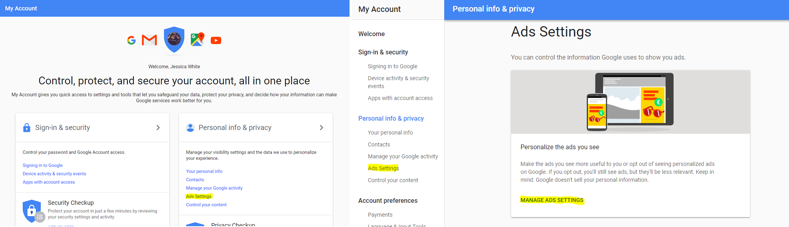
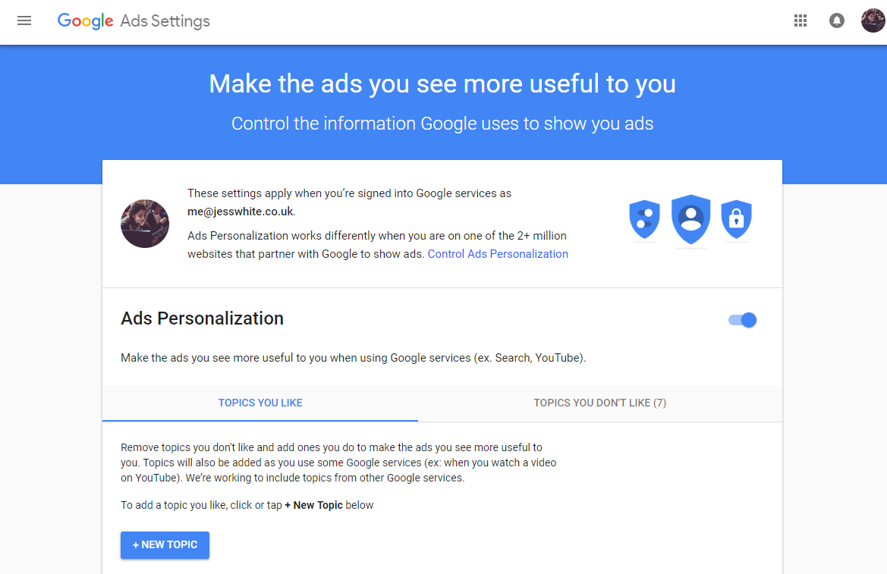
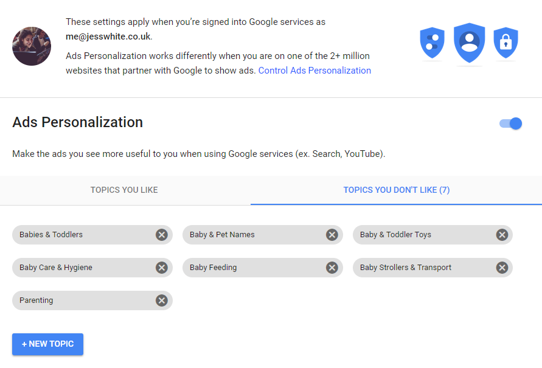

----

<h3> Changing </h3>

--- 
 

### Why this might be helpful

Google enables you to change your targeted adverts so you can indicate what you do and don't want to see. 

### Steps to changing your adverts

 * Go into your account settings. This can be done by clicking on your avatar in the far right corner and clicking on 'My Account'.
 
 

 
 

 * Click on Ad Settings and navigate to manage add settings.

 

 

* Here you can list the topics you like to see and those you don't like to see.

 
 

* Here is what the list of topics looks like if you want to to remove parenting and babies from your targeted adverts. There is also the option of turning off targeted ad's but I am not sure what the user experience would be like.

 

 
 

#### And that's it

Happy Googling.

### Here is the reference

- [Zen and the Art of Systems Monitoring](https://www.scalyr.com/community/guides/zen-and-the-art-of-system-monitoring)
