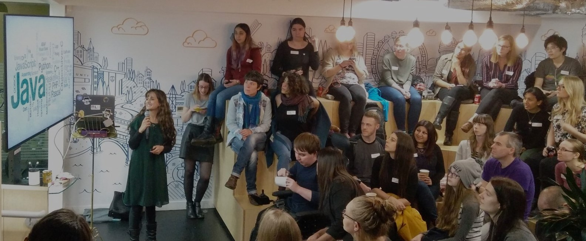
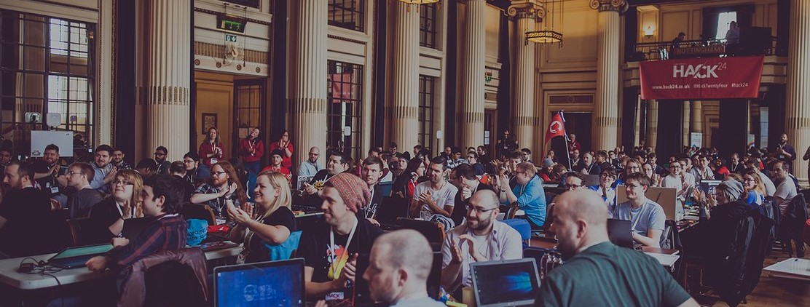

----

<h3> Nottingham's excellent tech scene and offerings. </h3>

--- 
 

Nottingham is a great place to be in tech, and not only because of the brilliant businesses and projects ([see the Tech Nation report from last year](https://technation.techcityuk.com/cluster/nottingham/)). It has a fantastic community and culture, as well as events and experiences to enjoy.

Here is a list of a few things that make Nottingham a great tech city in my opinion.

### Meetups

There are currently over 30 tech meetups arranged in Nottingham. A list of the event and times can be found at [Nottingham.Digital](https://nottingham.digital/).

 

 
 

### Hackathons
 
There are a few hackathons around the midlands - including [Hack Manchester]() and [Hack The Midlands](). Nottingham now hosts a number of different hackathons, each with their own uniqueness.

- **[Notts GovJam](http://www.govjam.org/content/about)** is happening on the 6th - 7th of June. The challenges of this hack is to find innovative solutions to problems faced by the public sector. As far as I'm aware, this is the first GovJam to be hosted in Nottingham. There are some fantastic people involved so it's sure to be a fantastic event.

- **[HackNotts](http://hacknotts.com/)** is a hackathon for high school, undergraduate or postgraduate students, or graduates who are less than a year out of university. Hackathons are a great place and environment to learn. If you aren't eligible to take part in the hack - that's okay! Be a volunteer! You can soak up the fun of the event, help keep it running smoothly and meet some fantastic people making great projects.

- **[Global Game Jam](https://globalgamejam.org/)** has already happened this year, in January. The focus of this event is for teams to make games with advice for some lead game developers. A theme is given out at the beginning of the event and sponsors make various tools available throughout the 48 hours. It's not a competition, just a chance to have fun making something cool.

- **[Hack24](https://www.hack24.co.uk/)** has also already happened this year. I've written about it previously in my blog post [Hack24 '17, The Greatest Place On Earth](http://jesswhite.co.uk/hack242017-post/), and as you can probably tell from that title alone it is very close to my heart. Sponsors set challenges for teams to take part in and compete to win challenges. The focus of the event isn't the competition though. There is fantastic food, games, and general merriment. 

I could write an entire post on all the great things about hackathons and the benefits of them. One day I might, but you should definitely try to experience one for yourself. You don't need to be a developer! Just arrive wanting to have fun!

 

 
 

### Hackspaces

[Nottinghack](http://nottinghack.org.uk/) is a fantastic hackspace. With the membership being based on a ‘Pay What You Think Is Right’ system​. There is a lot of equipment available including 3D printers, laser cutters, wool and more. 

Alongside the equipment (with training on offer) there is a great community that attend Nottinghack. 

You can attend just to hang out with like minded people, make something or attend a course and learn something new!

The next workshop available from the date of this post is the [Ardunio Workshops](http://nottinghack.org.uk/introduction-to-arduino-workshop/) on Saturday 26th May. 

### Podcasts

If you want to get involved in the tech scene, but aren't too sure about the face-to-face aspect yet - how about checking out some of the local podcasts. There are a few about - but here are three you can start with.

- **[Cynical Developer](https://cynicaldeveloper.com/)** is probably the most technical of the three. Hosted by James Studdart - topics cover desktop, web and mobile development, mainly around the .Net Stack but often looking into other software and frameworks.

- **[Twine Radio](http://twineradio.co.uk/)** - is hosted by Jonathan Relf. He talks with local meetup organisers and inflencencers about their events, what has happened and what is up ahead.

- **[BookClubPod](http://twineradio.co.uk/)** hosted on TwineRadio this is a brand new podcast. Jonathan Relf, Karl Bagci, Tom Jepson and I talk about some of the tech and non-fiction books we have read, what we think of them and how they influence our work. We plan to have guests in the future. It is a very relaxed podcast, just friends getting together and talking about their reads.

### Code Club

[Code Club](https://www.codeclub.org.uk/) is a remarkable organisation that runs free coding clubs for young people aged 9 - 13 years. It is completely volunteer lead and there are currently ~ 49 venues in Nottingham who have run a Code Club or intend to run one soon.

There are 6 venues are looking for a volunteer to help them get started so now is a great time to get involved as a volunteer. If you are considering starting a club in a venue near you there is also [a FREE online FutureLearn course called “Prepare to run a Code Club”](https://www.futurelearn.com/courses/code-club).

For more info email : [eastmidlands@codeclub.org.uk](mailto:eastmidlands@codeclub.org.uk)

### National Videogame Arcade

There is a lot on offer at [The National Videogame Arcade](https://www.thenva.com/). Its well known for ALL THE GAMES but there are also workshops, events, corporate hire, parties and more. 

One such event that is returning this year (2018) is the [Game City Festival](https://www.thenva.com/gamecity-festival/). It launched in 2006, and celebrates independent videogames and celebrating videogame culture.

### Games

A bit of a tangent away from tech related things - there are some great places to play games as well. Go to [Dicecup](https://en-gb.facebook.com/thedicecup) and [Ludorati](www.ludoraticafe.com/) to play boardgames or D'n'D. Both have very knowledgeable staff, refreshments and a WHOLE LOT of games. If you prefer something more digital - [ALT](https://en-gb.facebook.com/altgaminglounge/) might be more up your street. Again you can play alone, with friends or attend one of their many events.

### Community

