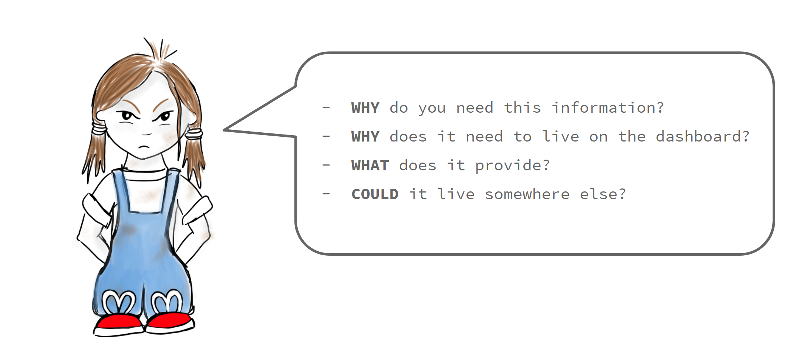
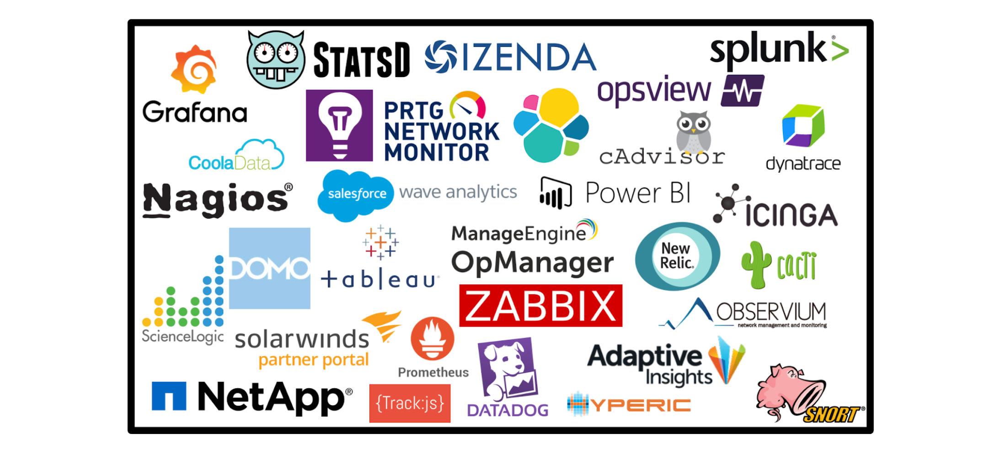

----
<center>
<h3> Handy tips to keep those dashboards dazzling. </h3>
</center>
--- 
<br/>

In the earlier blog post [Who Needs Dashboards?](http://jesswhite.co.uk/whoneedsdashboards-post/) we explored why dashboarding is important and some different types of dashboard in a business. It also explored how dashboarding increases transparency and communication in a business, and the benefits of this. 

This post will cover some hints and tips on how to ensure the dashboards you create are easy to maintain and suitable for their purpose.

### What is a dashboard again?

Dashboards are also known as visualisations. They are used to display information that is useful in a way that is easy to understand and react to. There are quite a few examples of dashboards that are used day-to-day outside of technology. 

An example of an everyday dashboard is a dashboard in a car. There are a few different ways that information is conveyed on a car dashboard. The information that you need the most, how fast you are going and how much fuel is in the tank, is most readily available. This information is normally shown, ever-present on big dials that are easy to see and read. 

A driver would also need to be alerted if there was something wrong with their car that they may need to act on - the oil needs changing or there is a problem with the engine. These will also appear on a dashboard but in a different way to the information that is needed all the time. This is so that attention is drawn to it, that the driver knows it is more urgent. Some cars may show them as a specially shaped light that flashes up when there is a problem. For less urgent alerts, they may show up in a different colour or format. Examples are that the cars indicator lights or fog lights are on. 

<br/>
<div style="text-align:center; width:80%; margin-left: 10%;" markdown="1">

</div> 
<br/>

Dashboards are used in very much the same way when covering projects, initiatives and systems. A good dashboard should be easy to read and react to. The information you need on a regular basis should be easy to identify, but if something is abnormal and needs to be reacted to urgently, it should attract the attention of those that need to react to it.

### How come my dashboards aren't as useful as the one in my car?!

It's simple - dashboarding is a difficult thing to do well. There are many ways in which things can go astray. For the rest of this post we will go through some ways in which you can determine what should and shouldn't be on a dashboard. How to spot when a dashboard may need some cleaning up will also be covered. 

### Danger Signs

There are a number of signs that a dashboard may need a bit of clearing up or re-work. Here we will go through a few of them, why they might happen and what to do when they do.

```
Out of date metrics
Lack of purpose
Unclear metrics
Not knowing how to react to measurements
Busy boards
Making dashboards as part of a tick box exercise
Too many boards
Not knowing the baseline behaviour
Single point of responsibility
Pie Charts
Vanity Metrics.
```

### Talking to stakeholders.

Previously when trying to find out what needed to go on a dashboard, I would ask the stakeholders of the feature or project what they wanted or needed to see on a dashboard. Though the intentions were right, this would lead to metrics that weren't useful and dashboards that were largely ignored. If they had metrics that were more useful or clear, a few problems may have been averted or spotted earlier. 

Talking to the stakeholders was the right thing to do, but the questions needed framing in a different way. For instance, 


### Requirement gathering and pushing back.

<br/>
<div style="text-align:center; width:80%; margin-left: 10%;" markdown="1">

</div> 
<br/>


### Lifetimes


### Layers


### Picking which tools you should use.

<br/>
<div style="text-align:center; width:80%; margin-left: 10%;" markdown="1">

</div> 
<br/>

