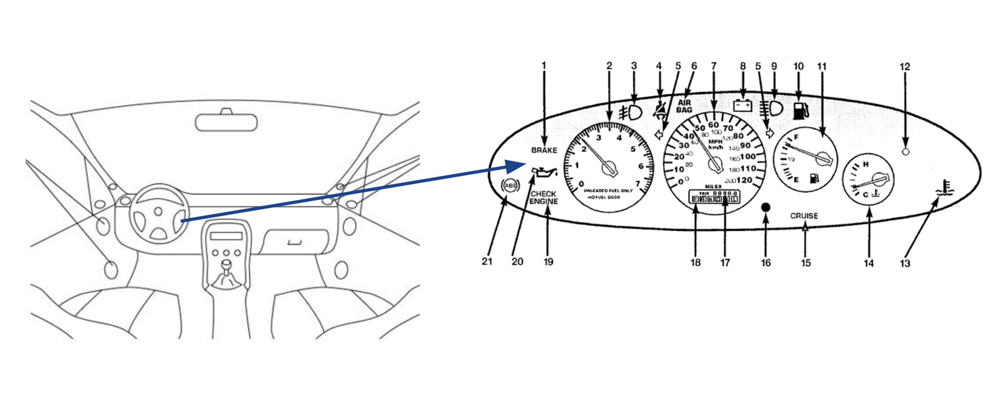
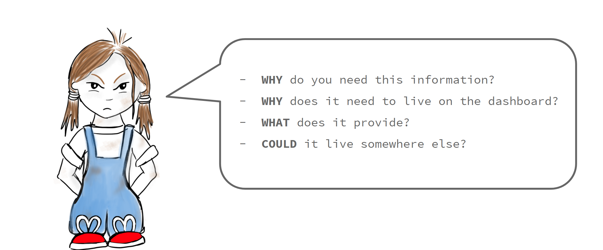
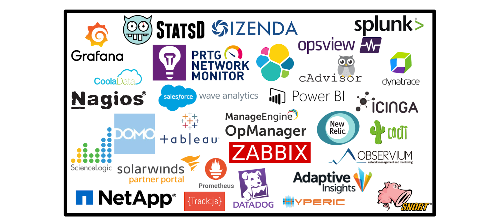

----

<h3> Handy tips to keep those dashboards dazzling. </h3>

--- 
 

In the earlier blog post [Who Needs Dashboards?](http://jesswhite.co.uk/whoneedsdashboards-post/) we explored why dashboarding is important and some different types of dashboard in a business. It also explored how dashboarding increases transparency and communication in a business, and the benefits of this. 

This post will cover some hints and tips on how to ensure the dashboards you create are easy to maintain and suitable for their purpose.

### What is a dashboard again?

Dashboards are also known as visualisations. They are used to display information that is useful in a way that is easy to understand and react to. There are quite a few examples of dashboards that are used day-to-day outside of technology. 

An example of an everyday dashboard is a dashboard in a car. There are a few different ways that information is conveyed on a car dashboard. The information that you need the most, how fast you are going and how much fuel is in the tank, is most readily available. This information is normally shown, ever-present on big dials that are easy to see and read. 

A driver would also need to be alerted if there was something wrong with their car that they may need to act on - the oil needs changing or there is a problem with the engine. These will also appear on a dashboard but in a different way to the information that is needed all the time. This is so that attention is drawn to it, that the driver knows it is more urgent. Some cars may show them as a specially shaped light that flashes up when there is a problem. For less urgent alerts, they may show up in a different colour or format. Examples are that the cars indicator lights or fog lights are on. 

 

 
 

Dashboards are used in very much the same way when covering projects, initiatives and systems. A good dashboard should be easy to read and react to. The information you need on a regular basis should be easy to identify, but if something is abnormal and needs to be reacted to urgently, it should attract the attention of those that need to react to it.

### How come my dashboards aren't as useful as the one in my car?!

It's simple - dashboarding is a difficult thing to do well. There are many ways in which things can go astray. For the rest of this post we will go through some ways in which you can determine what should and shouldn't be on a dashboard. How to spot when a dashboard may need some cleaning up will also be covered. 

### Talking to stakeholders.

Previously when trying to find out what needed to go on a dashboard, I would ask the stakeholders of the feature or project what they wanted or needed to see on a dashboard. Though the intentions were right, this would lead to metrics that weren't useful and dashboards that were largely ignored. If they had metrics that were more useful or clear, a few problems may have been averted or spotted earlier. 

Talking to the stakeholders was the right thing to do, but the questions needed framing in a different way. It's often easy to think of what we want but it takes a lot of thought to determine wht we need and often, we only find out what we need through experience.

These conversations are lead by the type of dashboards that are being created and their purpose. 

**High level business intelligence or management information dashboards**

These boards are to aid and monitor strategic or tactical goals within a business. As such we want to cover the objectives of these intiatives and whether there are problems that may need early intervention.

Some of the questions you may ask your stakeholder(s) for these dashboards include:

> What are the company objectives?

If this is a Business Intelligence (BI) style dashboard it is going to be primarlily concerned with how well the business is meeting the goals agreed by investors, upper management and directors. These metrics will be used to aid decisions about the focuses of the company, how they can progress, grow and stay afloat. By determiing what the company objectives are that need to be monitored, we can determine what success would look like, and the elements that might be a risk to these objectives.

Managment Information (MI) have projects aiding in the success of these overall objectives. Again by knowing which company objective these intiatves are targeted at aiding, we can measure to determine the effect its having on the overall company objective.

> What are the KPI’s of your project
 
KPI is an acroynm that stands for [Key Performance Indicator](). Most company plans and objectives will have KPI's associated with them. Again by having measurements associated with these, the succcess of the intiatives can be monitored as well as their progress. If it doesn't look like a KPI is going to be met, reactive measures can be taken.

> How might this initiative fail?

This is the trickiest one to broach out of the three, but is useful for pretty much every dashboard you will create. Much like with our car dashboard - we want to know when something is failing, especially if we might have something we can do about it or measures to take to minimise the impact of the damage.

No one likes to think about failure, but no one is going to be more aware of the ways it may fail than the experts of the domain. Much like a car manufacturer, who designed and built the car you are driving, have thought about the failures a car may have and put in alerts around that, those working directly with or a domain or that have thought of an initative will probably have a better idea of possible failures.

**Execution dashboards (operations/development)**

> How do you know an app / feature is working?

> What are the KPI’s 

> Why are those KPIs What do they tell you?

> What are the base metrics we would normally use for this?

**This does not even nearly cover all the questions you may want to cover with your stakeholders** but it gives you an idea. You need to have the context of why things are measured, how they might be reacted to and how long they need to be measured for. This brings me nicely onto the next section.

### Requirement gathering and pushing back.

There are going to many points in the creation and maintainence of your dashboards where people will be making suggestions about what should be on them. It might be in the initial conversation with your stakeholders, it may be in a passing comment or it may be a requirement added later on. 

When having these conversations, there is one rule I stick to. While maintaining a degree of professionalism - **channel your inner toddler**.

 

 
 

We all know that ~annoying~ adorable phase all kids go through when they are curious about everything in the world. They want to know _why_, _when_, _what_, _who_ and then they might go back to why and the cycle contines. If we channel our inner toddlers and revert back to this tendency - we can keep our dashboards beautiful, clean and useful.

### Picking which tools you should use.

 

 
 

