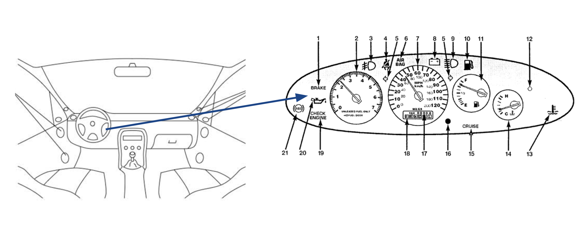

----
<center>
<h3> More handy tips to keep those dashboards dazzling - Maintainence. </h3>
</center>
--- 
<br/>

In the earlier blog post,..
 

<br/>
<div style="text-align:center; width:80%; margin-left: 10%;" markdown="1">

</div> 
<br/>

### Lifetimes


### Layers

### Danger Signs

There are a number of signs that a dashboard may need a bit of clearing up or re-work. Here we will go through a few of them, why they might happen and what to do when they do.

```
Out of date metrics
Lack of purpose
Unclear metrics
Not knowing how to react to measurements
Busy boards
Making dashboards as part of a tick box exercise
Too many boards
Not knowing the baseline behaviour
Single point of responsibility
Pie Charts
Vanity Metrics.
```

### Hate pie


### Lifetimes


### Layers


### Picking which tools you should use.

<br/>
<div style="text-align:center; width:80%; margin-left: 10%;" markdown="1">

</div> 
<br/>

